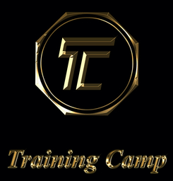

## About "Training Camp"

This is my graduation project from the web devevlopment bootcamp at neuefische Hamburg.

The Trainingcamp App has been developed to make the club life in a sport-bootcamp easier for you. Use the Trainingcamp App to get a quick overview of your member list or plan sparring assignments of athletes anytime and anywhere.

---

## Used technologies:

-   **PHP 7.x**
-   **Laravel**
-   **Eloquent ORM**
-   **Vagrant 2.2.7**
-   **HTML5**
-   **CSS3**
-   **mySQL**
-   **Bootstrap4**
-   **OOP**
-   **npm**
-   **GitHub**
-   **Git-Workflow**
-   **composer**
-   [**Uberspace-Hosting**](https://star.uber.space)
-   **Kanban**
-   **Javascript**
-   **PHPUnit**
