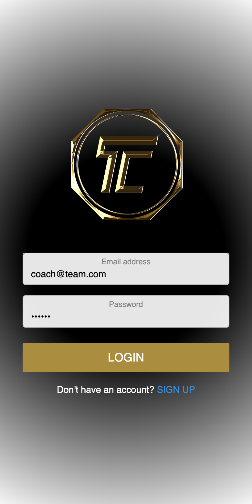
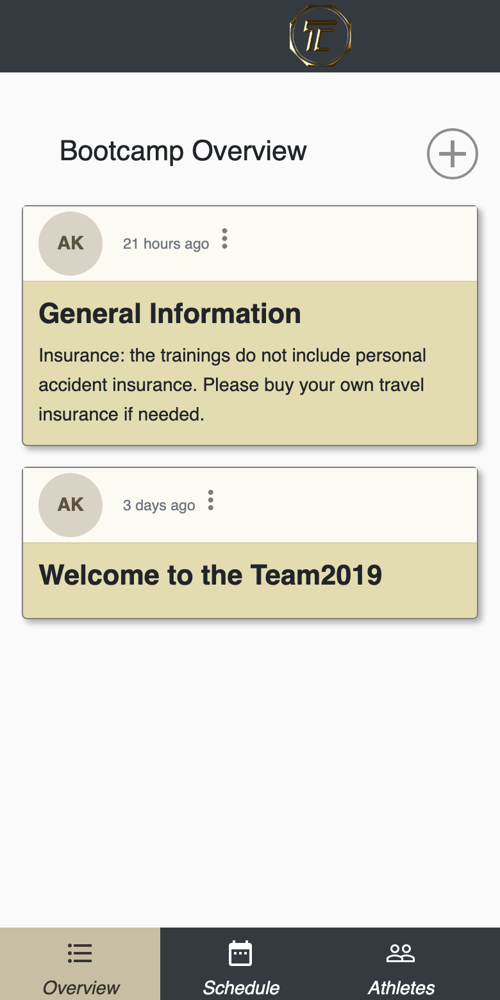
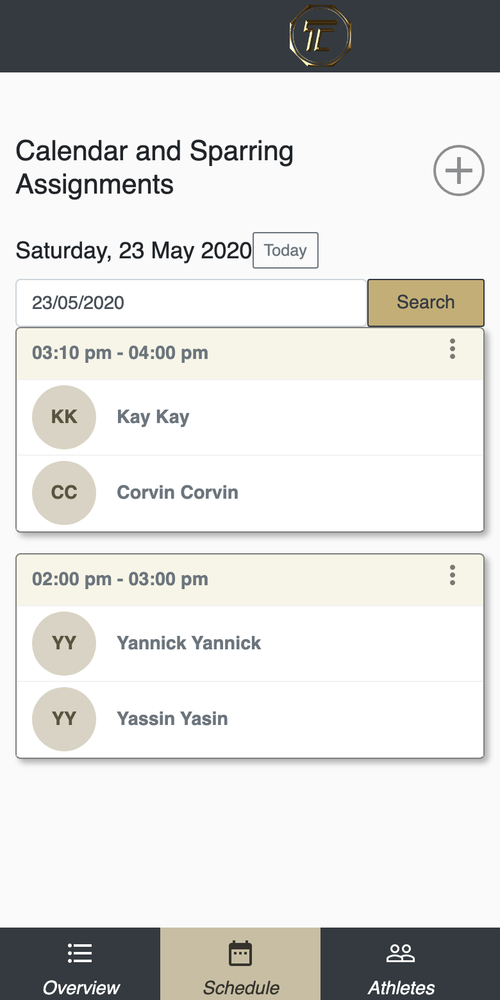
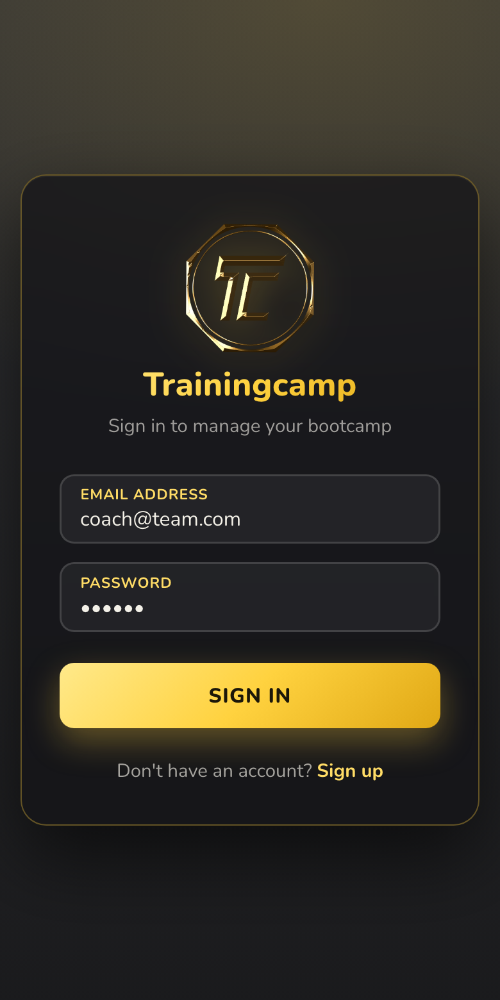
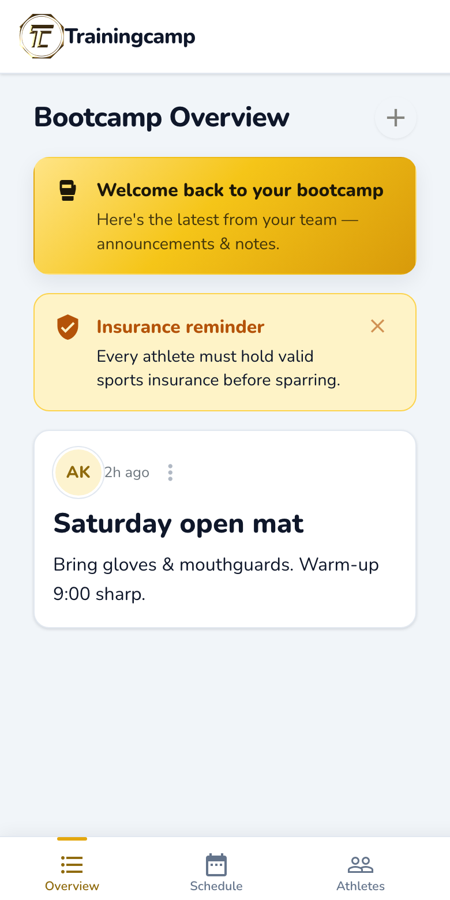
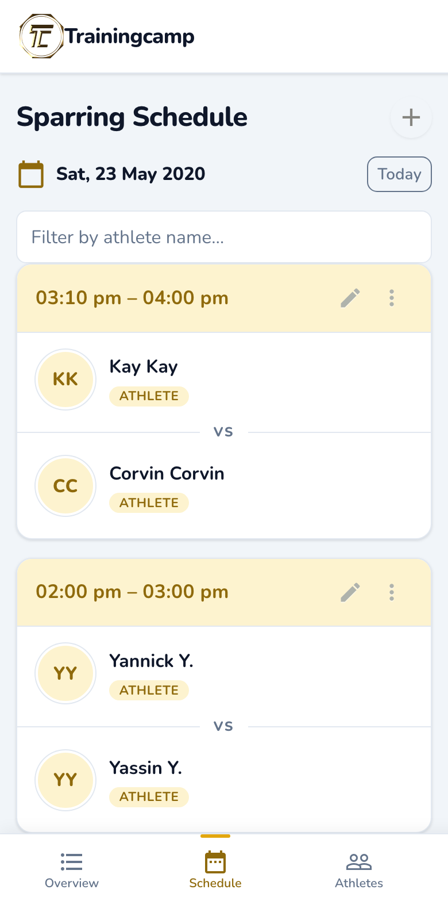
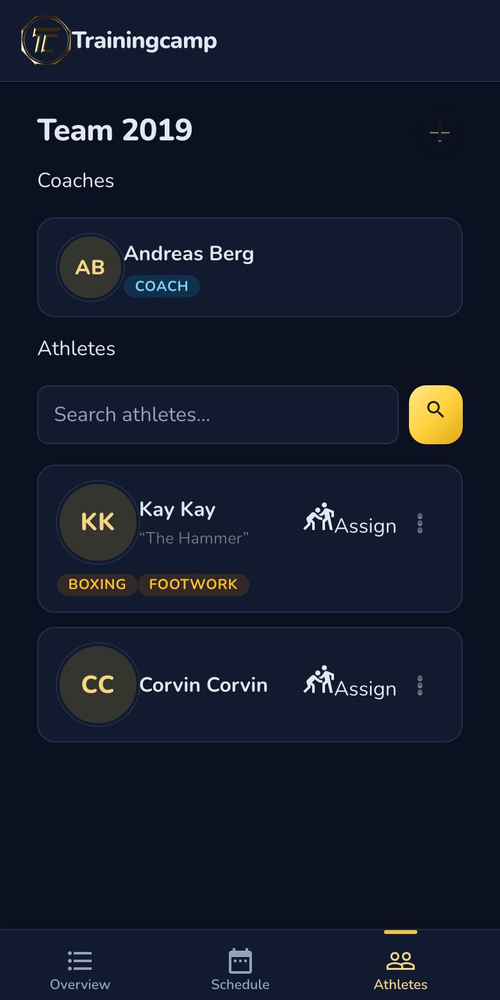
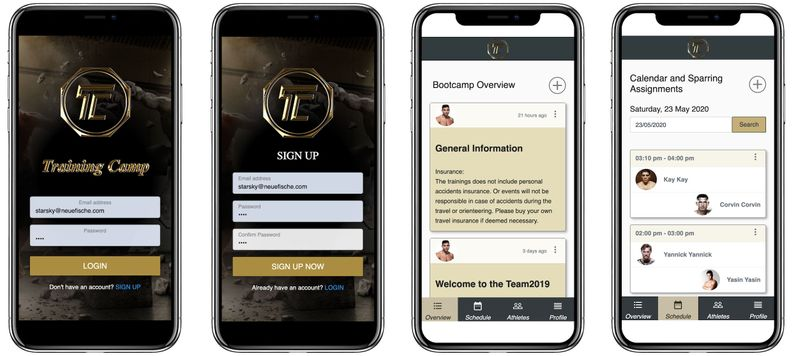

<p align="center">
  
</p>

<h1 align="center">Training Camp</h1>

<p align="center">
  A mobile-first Laravel app for managing a sports club's members, sparring sessions, schedules, and tasks.
</p>

<p align="center">
  
  
  
  
</p>

## Overview

Training Camp is a graduation project built to make daily club coordination easier for coaches and athletes. It combines team management, sparring schedules, profile management, and a lightweight task planner in one responsive web app.

## Table of contents

- [Features](#features)
- [Screenshots](#screenshots)
- [Tech stack](#tech-stack)
- [Requirements](#requirements)
- [Quick start](#quick-start)
- [Useful routes](#useful-routes)
- [Testing and code quality](#testing-and-code-quality)
- [Styling and front-end workflow](#styling-and-front-end-workflow)
- [Project structure](#project-structure)

## Features

### Core product features

- **Authentication**: sign up, sign in, sign out, account settings, and profile setup.
- **Team management**: create your team, add coaches and athletes, manage roles and skills.
- **Member profiles**: avatars, personal details, and team-based profile views.
- **Notifications / dashboard**: quick overview of club activity and reminders.

### Scheduling features

- **Daily sparring schedule** with time slots and paired athletes.
- **Multiple calendar views**: List, Day, Week, Month, and Planner.
- **Schedule metadata**: title, location, notes, color, video URL, and video type.
- **Fast filtering**: search schedules for athletes on the selected day.
- **Planner view**: combines the day's sparring schedule with open tasks.

### Task management

- Create, edit, delete, and complete tasks.
- Organize tasks by **overdue**, **today**, **upcoming**, **no date**, and **done**.
- Track optional notes, labels, priorities, due dates, and due times.
- Team scoping ensures users only manage tasks from their own team.

### UX and design

- **Responsive mobile-first UI** built for quick use at the gym.
- **Light and dark mode** with persistent theme selection.
- Refreshed card-based interface with branded Training Camp styling.

## Screenshots

### Before → after (mobile)

| | Login | Overview | Schedule |
|---|---|---|---|
| **Before** |  |  |  |
| **After** |  |  |  |

### Dark mode

<p align="center">
  
</p>

## Tech stack

- **PHP 8.3+**
- **Laravel 13**
- **Blade** templates
- **Eloquent ORM**
- **Bootstrap 5**
- **Sass**
- **Vite**
- **SQLite** by default, **MySQL** optional
- **PHPUnit 12**
- **PHP_CodeSniffer** with PSR-12
- **GitHub Actions** CI on PHP 8.3 and 8.4

## Requirements

### To run the app

- PHP **8.3+**
- Composer

### To work on styles / front-end assets

- Node.js **18+**
- npm

> The compiled CSS in `public/css/` is committed, so Node.js is not required just to run the app.

## Quick start

```bash
git clone https://github.com/stqrsky/trainingcamp.git
cd trainingcamp

composer install
composer setup
php artisan serve
```

The app will be available at `http://127.0.0.1:8000`.

### What `composer setup` does

- creates `.env` if needed
- creates `database/database.sqlite` if needed
- generates `APP_KEY`
- runs `php artisan migrate --seed --force`

### Seeded data

- The seeders create demo users, roles, skills, and teams.
- Seeded demo users use the password `secret`.
- You can also simply create your own account at `/signup`.

### Using MySQL instead of SQLite

Update your `.env` with:

- `DB_CONNECTION=mysql`
- your database host, port, database name, username, and password

Then run:

```bash
php artisan migrate --seed
```

## Useful routes

| Area | Route |
|---|---|
| Home | `/` |
| Sign up | `/signup` |
| Sign in | `/login` |
| Athletes / members | `/user/athletes` |
| Profile | `/user/profile` |
| Schedules list | `/schedules` |
| Calendar day view | `/schedules/day` |
| Calendar week view | `/schedules/week` |
| Calendar month view | `/schedules/month` |
| Planner view | `/schedules/planner` |
| Tasks | `/tasks` |

## Testing and code quality

Run the test suite:

```bash
composer test
```

Or:

```bash
php artisan test
```

Run PHP_CodeSniffer:

```bash
./vendor/bin/phpcs --standard=PSR12 app tests
```

CI runs automatically on pushes and pull requests against `master` and `main` using GitHub Actions.

## Styling and front-end workflow

This project currently loads compiled CSS files directly from `public/css/`:

- `public/css/app.css`
- `public/css/signin.css`
- `public/css/athlete.css`

The source styles live in `resources/sass/`.

Install front-end dependencies first if you have not already:

```bash
npm install
```

If you change Sass files, recompile them manually:

```bash
npx sass resources/sass/app.scss public/css/app.css --load-path=. --style=compressed
npx sass resources/sass/signin.scss public/css/signin.css --style=compressed
npx sass resources/sass/athlete.scss public/css/athlete.css --style=compressed
```

Useful Sass files include:

- `_variables.scss` - Bootstrap overrides
- `_tokens.scss` - theme-aware design tokens
- `_components.scss` - shared UI components
- `_calendar_tasks.scss` - calendar and task styling

## Project structure

| Path | Purpose |
|---|---|
| `app/Http/Controllers` | request handling for auth, schedules, tasks, teams, notifications |
| `app/Models` | Eloquent models such as `User`, `Team`, `Schedule`, and `Task` |
| `database/migrations` | schema changes including schedules and tasks |
| `database/seeders` | demo data for users, teams, roles, and skills |
| `resources/views/frontend` | Blade views for the user-facing interface |
| `resources/sass` | Sass source files |
| `routes/web.php` | web routes for auth, team, schedule, and task features |
| `tests/Feature` | feature coverage for schedules and tasks |

---

<p align="center">
  
</p>
