<p align="center">
  
</p>

<h1 align="center">Training Camp</h1>

<p align="center">
  A mobile-first Laravel app for combat sports coaches: members, sparring sessions, tasks and projects for one or more teams.
</p>

<p align="center">
  <a href="https://github.com/stqrsky/trainingcamp/actions/workflows/tests.yml"></a>
  
  
  
  
</p>

## Overview

Training Camp started as a graduation project and has grown into a small team platform for coaches. The account holder runs one or more teams from the phone or the desktop: plans sparring sessions, keeps track of tasks and projects, and manages athlete and coach profiles with skills, levels and availability.

Only the account holder signs in. Athletes and coaches are managed profiles without their own login.

## Contents

- [Screenshots](#screenshots)
- [Features](#features)
- [Quick start](#quick-start)
- [Tech stack](#tech-stack)
- [Optional integrations](#optional-integrations)
- [Development](#development)
- [Project structure](#project-structure)

## Screenshots

<p align="center">
  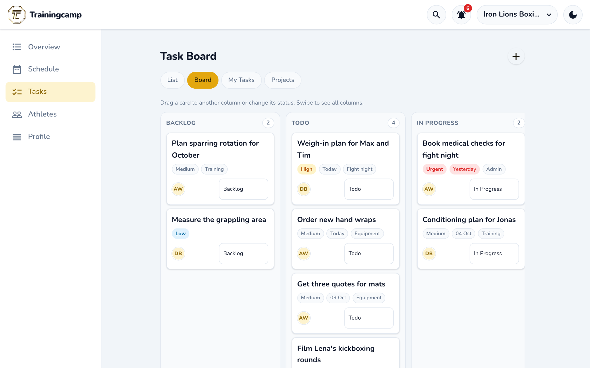
</p>

### On the phone

| Dashboard | Schedule | Tasks | Team |
|:---:|:---:|:---:|:---:|
| 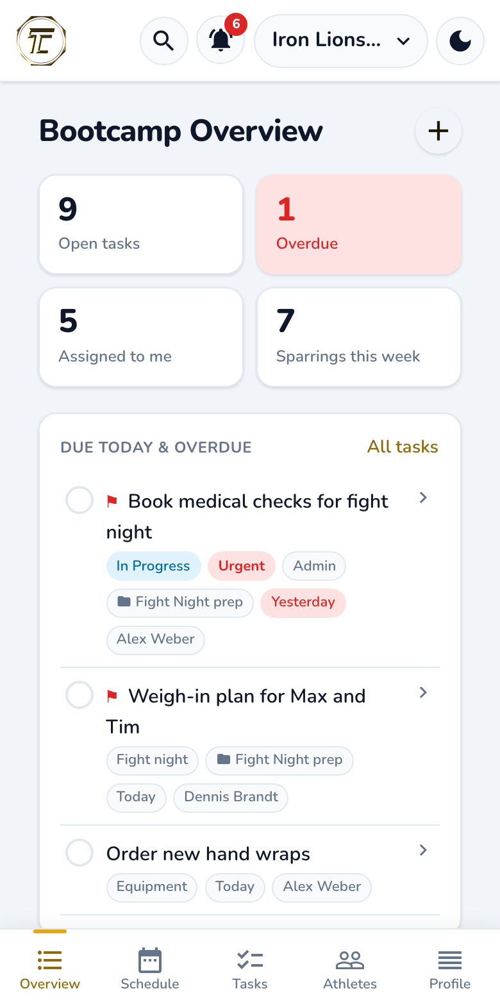 | 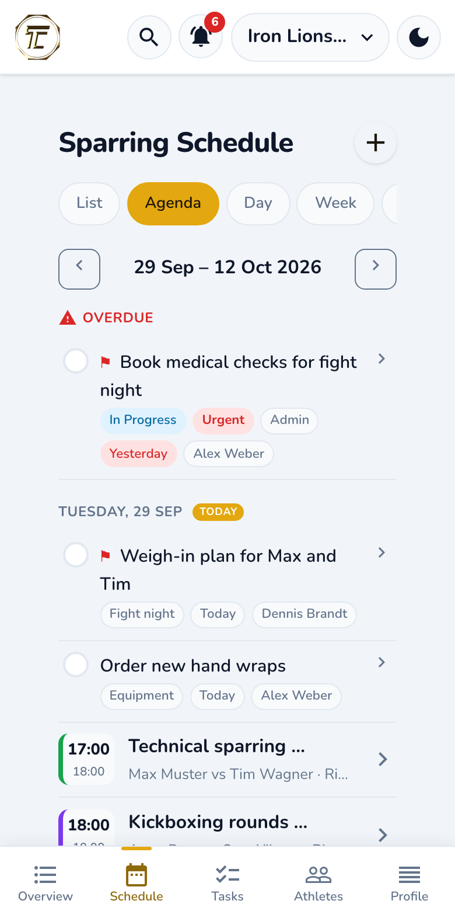 | 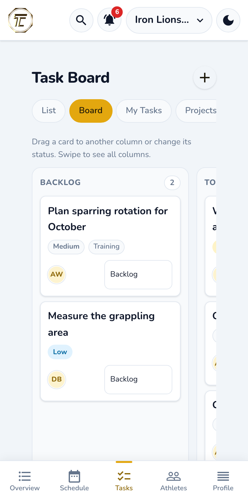 | 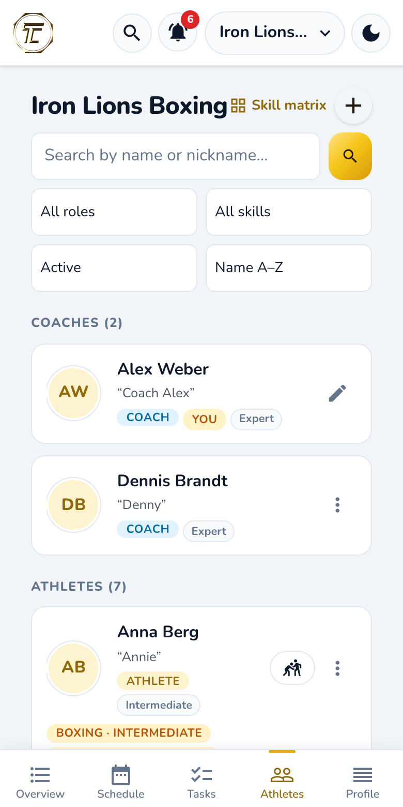 |
| 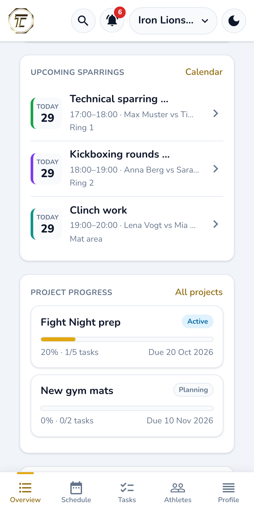 | 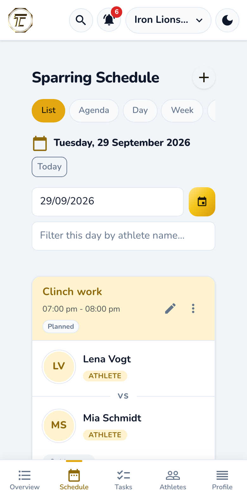 | 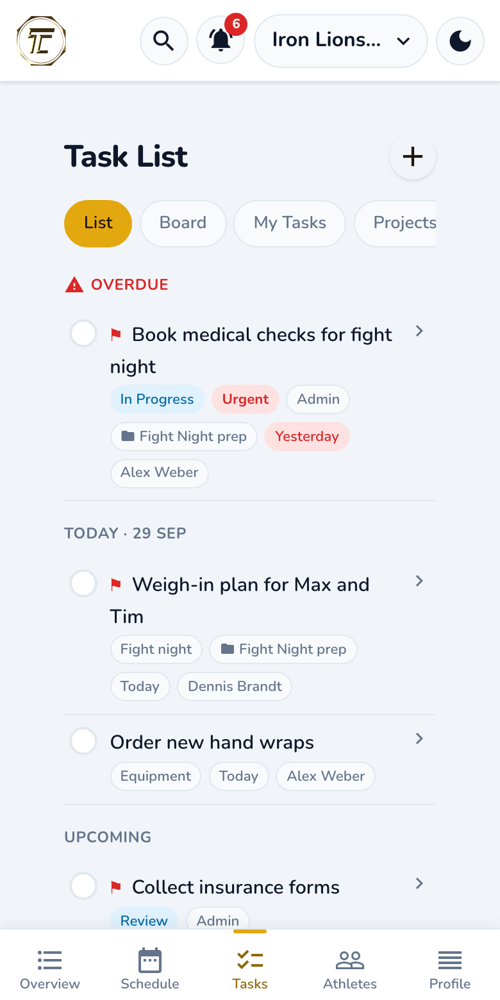 | 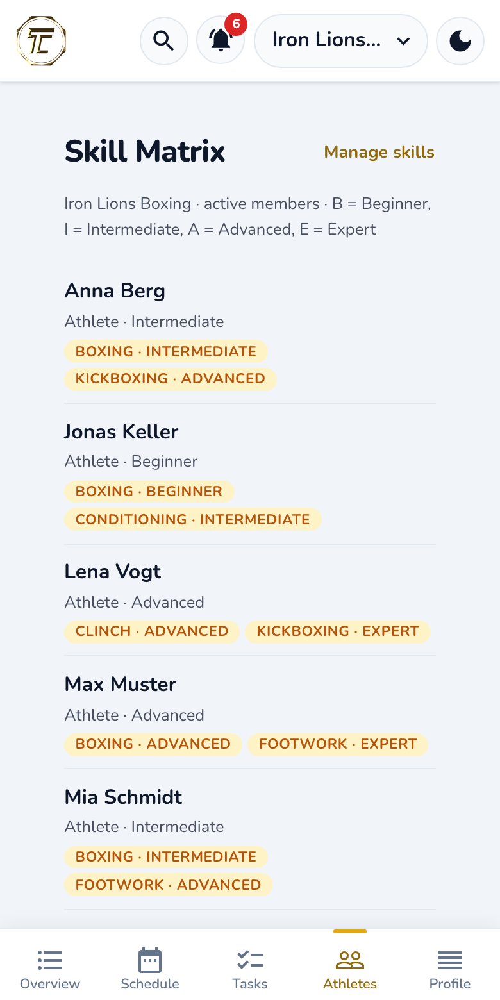 |

| Project | Activity | Search | Sign in |
|:---:|:---:|:---:|:---:|
| 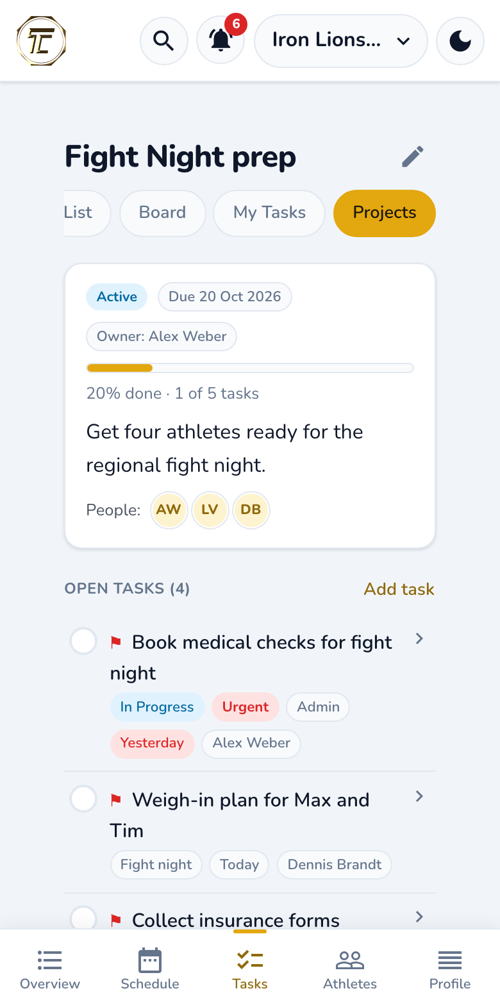 | 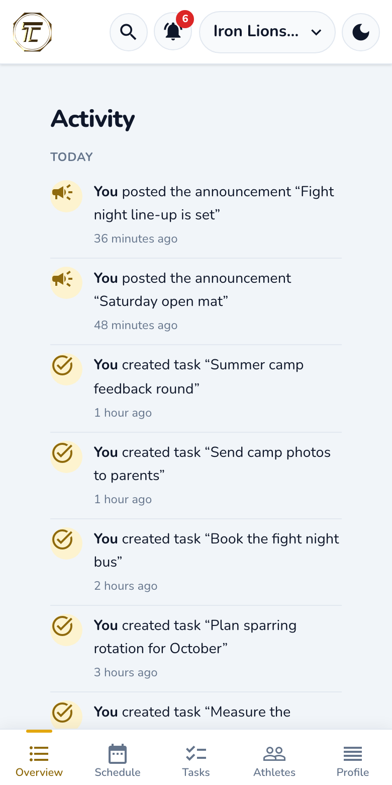 | 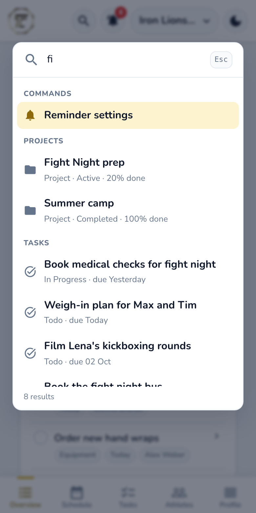 | 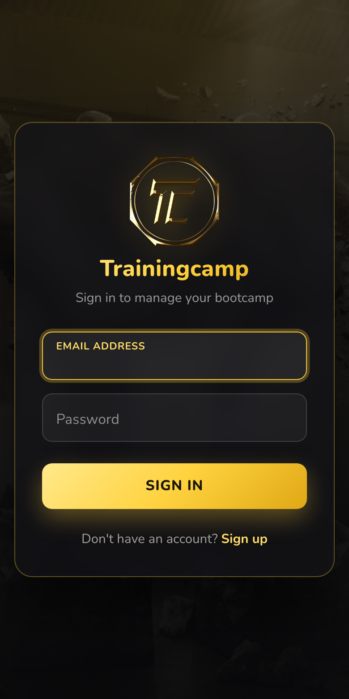 |

### Dark mode

<p align="center">
  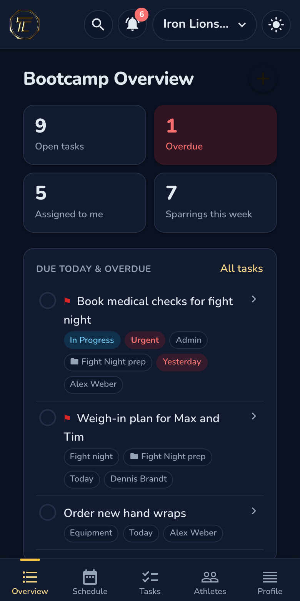
  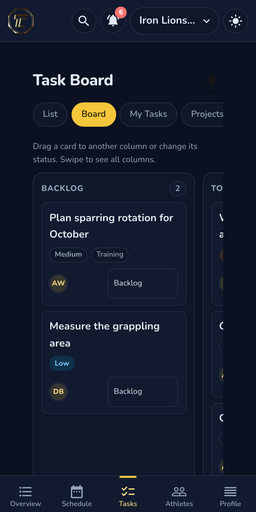
  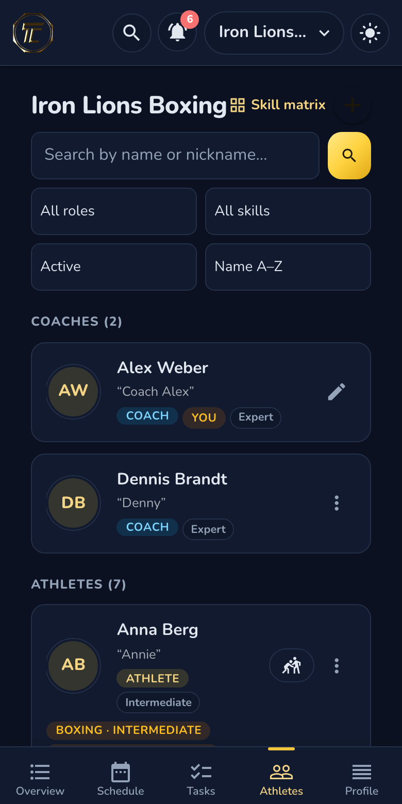
</p>

<details>
<summary>Then and now: the original graduation project next to today's version</summary>

| | Sign in | Overview | Schedule |
|---|:---:|:---:|:---:|
| **Then** | 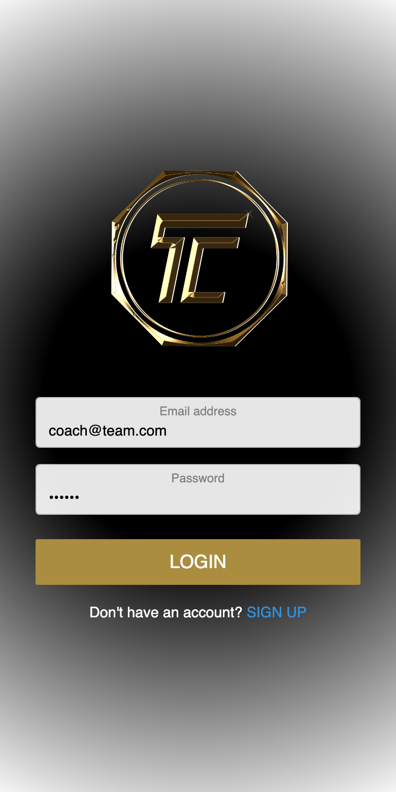 | 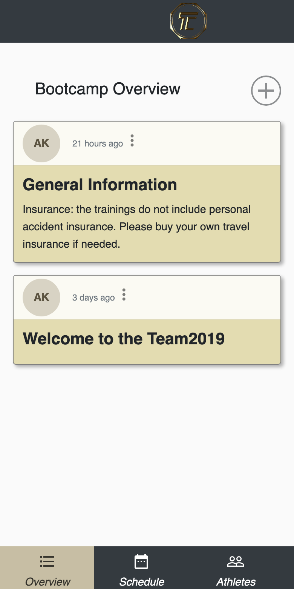 | 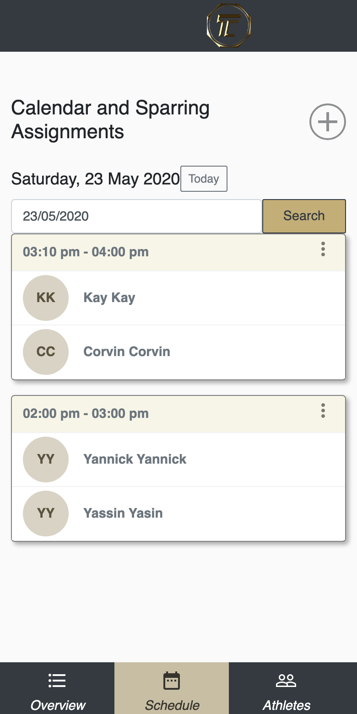 |
| **Now** |  |  |  |

</details>

All screenshots show demo data.

## Features

### Teams and members

- **Several teams per account.** Switch teams in the top bar; every page only shows the active team.
- **Member profiles** for athletes and coaches: experience level, team skills with a level each, weekly availability, weight and height.
- **Find people fast:** search by first name, last name or nickname, filter by role, skill and status, sort by name or recently added. Filters live in the URL, so a filtered list can be shared.
- **Active and inactive members.** Inactive members keep their history but can't be picked for new sparrings or tasks.
- **Skill matrix** with every athlete's level per skill. Each team maintains its own skill list.

### Sparring

- **Sessions** with two athletes, time, location, goal, notes, color and video link.
- **Status** from planned to confirmed, in progress, completed or cancelled, plus a result once the session is done.
- **Partner suggestions** that explain themselves: level, shared skills, a common time slot, weight difference and variety. Shown on the athlete page and in the sparring form.
- **Calendar views:** List (one day, with search), Agenda (next 14 days), Day, Week, Month and Planner. Open task deadlines appear in the calendar as well.

### Tasks and projects

- **Tasks** with status (backlog, todo, in progress, review, done), priority, assignee, due date and time, label and notes.
- **List, Kanban board and My tasks.** Cards move by drag and drop, or with a status select on touch devices and keyboards.
- **Projects** with status and deadline. Progress and members are derived from the project's tasks.

### Staying on top of things

- **Dashboard** with key numbers, tasks due today or overdue (check them off right there), the next sparrings, project progress, recent activity and all your teams.
- **Reminders** in the bell icon: overdue tasks, tasks due today and sparrings in the next 24 hours. Each type can be switched off.
- **Activity feed** for the active team.
- **Search and command palette** (Cmd+K or Ctrl+K) across members, tasks, sparrings and announcements, with quick commands such as "New task" or "Plan sparring".
- **Announcements** for the team on the dashboard.

### Design

- Mobile first with a bottom navigation, and a sidebar layout from 992 px.
- Light and dark mode, the choice is remembered.
- Accessible navigation with a skip link, a `<main>` landmark and `aria-current` on the active page.

## Quick start

Requirements: PHP **8.3+** and Composer. Node.js is only needed to work on the styles (see [Styling](#styling)).

```bash
git clone https://github.com/stqrsky/trainingcamp.git
cd trainingcamp

composer install
composer setup
php artisan serve
```

The app runs at `http://127.0.0.1:8000`. Create your account at `/signup`.

`composer setup` creates `.env` and `database/database.sqlite` if they are missing, generates `APP_KEY`, links uploaded images into `public/` (`php artisan storage:link`) and runs `php artisan migrate --seed --force`. The seeders add roles, skills, teams and demo users with the password `secret`.

<details>
<summary>Using MySQL instead of SQLite</summary>

Set `DB_CONNECTION=mysql` plus host, port, database name, username and password in `.env`, then run:

```bash
php artisan migrate --seed
```

</details>

## Tech stack

| Area | Tools |
|---|---|
| Backend | PHP 8.3+, Laravel 13, Eloquent, Blade |
| Frontend | Bootstrap 5, Sass (Dart Sass CLI), Material Icons, vanilla JS, jQuery slim and Select2 on a few forms |
| Database | SQLite by default, MySQL optional |
| AI (optional) | Claude API through the official Anthropic PHP SDK |
| Quality | PHPUnit 12, PHP_CodeSniffer (PSR-12), GitHub Actions on PHP 8.3 and 8.4 |

## Optional integrations

All three are off until you configure them in `.env`.

### Daily summary email

Account holders can switch on a morning summary under **Profile → Reminders**. The scheduler sends it at 07:00, and only when there is something to do (overdue or due tasks, sparrings that day). The scheduler needs the usual cron entry:

```bash
* * * * * cd /path/to/trainingcamp && php artisan schedule:run >> /dev/null 2>&1
```

Configure a real mailer in `.env` (`MAIL_MAILER`, `MAIL_HOST`, …). For local testing use `MAIL_MAILER=log` and run the command by hand:

```bash
php artisan trainingcamp:daily-digest
```

### Activity webhook (n8n)

Every activity (tasks, sparrings, projects, announcements, member changes) can be pushed to an automation tool such as an n8n **Webhook** trigger:

```dotenv
N8N_WEBHOOK_URL=http://localhost:5678/webhook/trainingcamp
N8N_WEBHOOK_SECRET=a-long-random-string
```

Each request is a JSON `POST` with the headers `X-Trainingcamp-Event` (e.g. `task.created`) and `X-Trainingcamp-Signature: sha256=<HMAC-SHA256 of the raw body with the secret>`. Verify the signature in the receiving workflow before acting on the data. The URL is set by the operator only, never through the UI.

### Team assistant (AI)

The assistant at `/assistant` answers questions about the active team ("What is overdue?", "Who should Anna spar with?", "How are our projects doing?") and turns meeting notes into task drafts. It uses the Claude API through the official Anthropic PHP SDK.

As long as `ANTHROPIC_API_KEY` is empty, the page only shows a setup hint, the top bar and the command palette hide it, and no data is sent anywhere. To turn it on:

```dotenv
ANTHROPIC_API_KEY=sk-ant-...
# optional, defaults to claude-opus-5
ANTHROPIC_MODEL=claude-opus-5
```

<details>
<summary>What the assistant can and cannot do</summary>

- **Read only, one team.** Claude looks data up through a fixed set of tools (tasks, sparrings, sparring partner suggestions, projects, members). Every lookup is limited to the active team. Contact details, birth dates, weight, height and profile texts are never sent.
- **Drafts, not writes.** Tasks proposed from meeting notes appear as drafts under the answer. **Review** opens the normal task form pre-filled; nothing is created until you save it there.
- **What leaves the server:** your question, the last few questions and answers of the chat (for follow-ups) and the tool results for the active team go to Anthropic's API.
- **Limits:** 10 questions per minute per account, at most 6 lookups per question. The chat lives in the session and can be cleared with **Clear chat**.
- Requests use adaptive thinking, prompt caching and server-side fallbacks (`fallbacks: "default"`, beta `server-side-fallback-2026-07-01`): if the model declines a request, Anthropic retries it on its recommended fallback model.

The tests never call the real API: `tests/Fakes/FakeClaudeTransport.php` plugs a fake HTTP transport into the SDK and records every request.

</details>

## Development

### Tests and code quality

```bash
composer test
./vendor/bin/phpcs --standard=PSR12 app tests
```

`composer test` runs the PHPUnit suite (`php artisan test` works too). GitHub Actions runs it on every push and pull request against `master` and `main`.

### Styling

The app loads compiled CSS straight from `public/css/` (`app.css`, `signin.css`, `athlete.css`). These files are committed, so deploying needs no Node.js build step. The sources live in `resources/sass/`:

- `_variables.scss`: Bootstrap overrides
- `_tokens.scss`: theme-aware design tokens (light and dark)
- `_components.scss`: app shell and shared components
- `_calendar_tasks.scss`: calendar and task styling

To change styles you need Node.js **20.19+** (required by Dart Sass):

```bash
npm install
npm run build   # compile all three stylesheets once
npm run dev     # recompile on every change
```

Both scripts run the Dart Sass CLI with `--load-path=. --style=compressed --no-source-map` (see `package.json`). Commit the updated files in `public/css/` together with the Sass changes.

The scripts also pass `--quiet-deps --silence-deprecation=import`. Bootstrap 5.3 itself still triggers several hundred Sass deprecation warnings, and `app.scss` has to keep `@import` for Bootstrap's variable overrides until Bootstrap ships Sass modules. Neither flag changes the compiled CSS.

<details>
<summary>Useful routes</summary>

| Area | Route |
|---|---|
| Dashboard | `/` |
| Sign up / sign in | `/signup`, `/login` |
| Team members | `/user/athletes` |
| Skill matrix | `/user/athletes/matrix` |
| Profile | `/user/profile` |
| Sparring schedule | `/schedules` (plus `/agenda`, `/day`, `/week`, `/month`, `/planner`) |
| Tasks | `/tasks` (board: `/tasks?view=board`) |
| Projects | `/projects` |
| Activity feed | `/activity` |
| Team assistant | `/assistant` |

</details>

## Project structure

| Path | Purpose |
|---|---|
| `app/Http/Controllers` | request handling for auth, teams, members, schedules, tasks, projects, search and the assistant |
| `app/Models` | Eloquent models such as `User`, `Team`, `Schedule`, `Task`, `Project` and `Activity` |
| `app/Services` | reminders, sparring partner matching and the team assistant |
| `app/Observers` | write the activity feed when tasks, sparrings, projects, posts or members change |
| `app/Http/Libraries/MemberProfile.php` | saving and validating member and own profiles |
| `config/navigation.php` | one place for the sidebar and bottom navigation |
| `database/migrations`, `database/seeders` | schema and demo data |
| `resources/views/frontend` | Blade views of the app |
| `resources/sass` | Sass sources of the compiled CSS |
| `routes/web.php` | all web routes |
| `tests/Feature`, `tests/Unit` | PHPUnit tests |
| `docs/` | roadmap and screenshots |

---

<p align="center">
  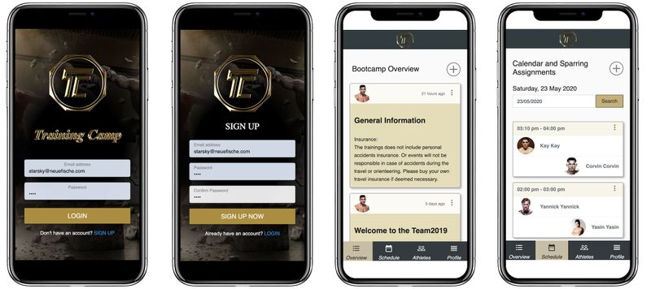
</p>
